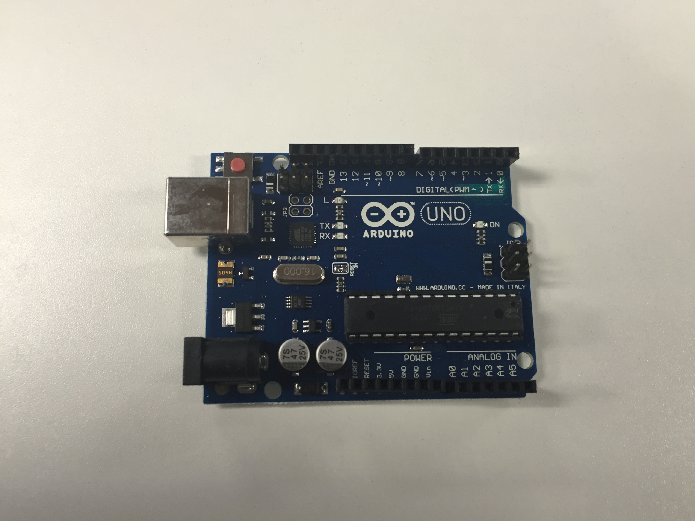
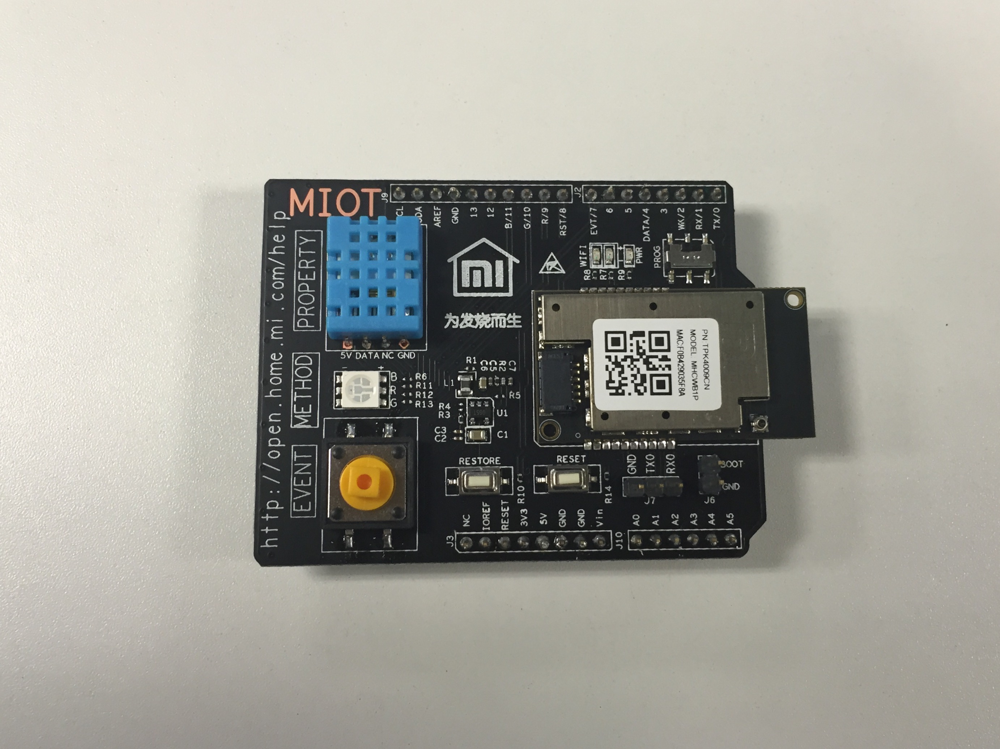

原文及部分资源下载地址：https://github.com/xuemulong/miio_tc_demo

##1.背景介绍：
小米开发板旨在帮助您了解小米智能硬件开放平台的开发模式，帮助您更快地进入产品开发阶段。  

##2.硬件框架
开发板由一块Arduino开发板和一块嵌入了小米智能模组的配对板组成。开发前请将两块电路板通过插针连接起来  

【Arduino开发板】扮演MCU的角色，提供处理能力，相当于您产品中的电路板

【配对板】包含小米智能模组，通过串口与MCU连接，负责提供WiFi等网络连接方式，与云端通信实现远程控制、手机操作等功能；同时嵌入了三个外设，包括RGB三色灯珠、一个大按钮和一个温湿度传感器

##3.烧写运行:
拿到开发板后，您需要向Arduino开发板烧写程序，具体操作如下  
(1) 下载固件程序（下载地址：https://github.com/xuemulong/miio_tc_demo） 
(2) 下载Arduino软件并安装 (下载地址：http://arduino.cc/en/Main/Software/).  
(3) 导入库文件：dht.cpp 和 dht.h（库文件导入方法：http://arduino.cc/en/Guide/Libraries，详见“如何安装库>手动安装”)  
(4) 将配对板右上角的拨码开关拨至左侧PROG，通过USB线连接Arduino板和电脑    
(5) 打开miio_tc_demo.ino，编译后写入开发板。请注意在“工具”中选择正确的开发板类型（Arduino Uno）和正确的串口  
(6) 将配对板右上角的拨码开关拨回右侧，回到普通工作状态，从电脑拔除开发板，完成烧写

##4.设备快连:
使用WiFi进行工作的智能设备，需要连接上路由器、并和用户建立联系后才能工作。您可以通过小米开发板来体验这个过程。  
(1) 请首先下载小米智能家庭App（下载地址 http://home.mi.com/index.html）  
(2) 打开小米智能家庭App，并使用您的开发者账号进行登录  
(3) 打开小米智能家庭App，点击右上角的“加号”，并按照提示连接小米开发板  
(4) 在完成小米开发板的快速连接后，您的设备列表中会出现一个新的设备，您就可以通过手机对开发板做一些简单操作了。

##5.云端调试
当您在开发过程中还未开发手机控制插件时，可以通过开放平台进行云端调试
(1) 请打开小米智能硬件平台，在“开发平台>开发板管理”中，找到您绑定的开发板，并点击“调试”进入云端调试页面
////////////////////////////////////////////////////  
///////////////////////待修改///////////////////   
////////////////////////////////////////////////////  
(1)下行过程描述如下：

   a.云端向MIIO下发命令来设置RGB: 
    
    set_rgb  [9]

   b.MIIO将云端发来的包含method的json串解析为文本命令，供Arduino获取

   c.Arduino 对MIIO每隔100ms发送文本命令，来获取云端命令：
   
    get_down 

   d.Arduino获取从MIIO串口发来的rgb文本命令: 
    
    down set_rgb 9

   e.Arduino执行命令，将RGB蓝灯点亮：
    
    set_color(0,0,9)

   f.整个过程为：Cloud->MIIO1.0->Arduino->DHT11

(2)上行过程描述如下：

   a.Arduino 每隔1s检测DHT11的状态(即温度和湿度),5min周期性上报一次,另外温湿度变化时，也会上报

   b.Arduino将获取的DHT11状态，以文本命令形式通过串口传给MIIO:

     props temperature 24      props humidity 56

   c.MIIO将温度和湿度放入json串，上报云端

   d.整个过程为：DHT11->Arduino->MIIO1.0->Cloud

##6.硬件连线:
这里提供了Arduino与外设及小米智能模组的连接方式，您可以研读Arduino程序并对程序进行修改。

(1) 连接Arduino与PC：使用USB线连接(用来供电、烧写代码)  
(2) 连接Arduino与MIIO芯片： Arduino的UART(pin 1 ,pin 0 ,pin GND)->MIIO 的UART1(UA1_RXD, UA1_TXD,GND)  
(3) 连接Arduino 与DHT11 ：Arduino的5V ,pin 4,GND->DHT11的V,D,G  
(4) 连接Arduino 与 RGB LEDS: Arduino的pin 9,pin 10,pin 11,GND->RGB LEDS的R,G,B,V-  
(5) 连接Arduino 与 Button:pin7-->button，给予高电平表示按下

